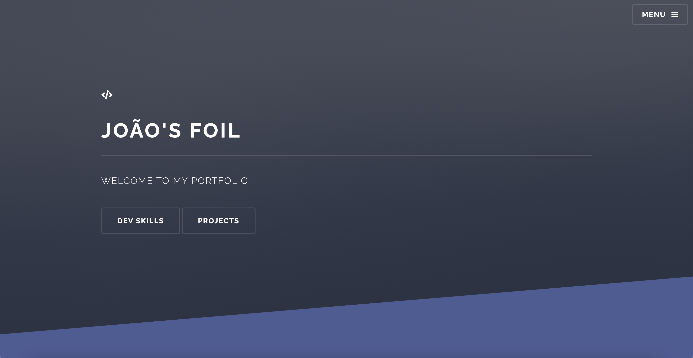
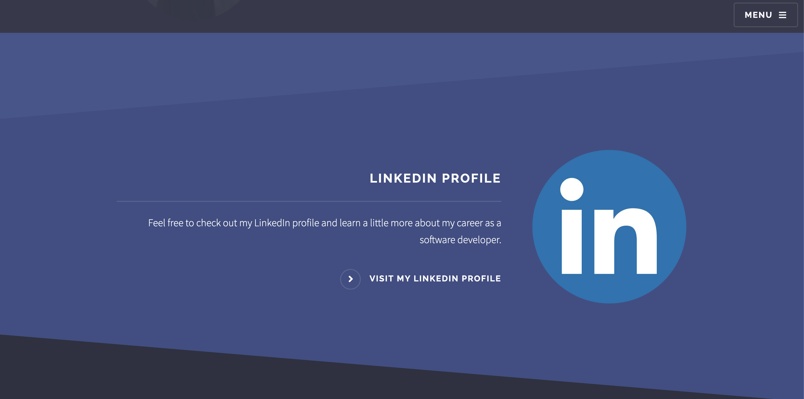
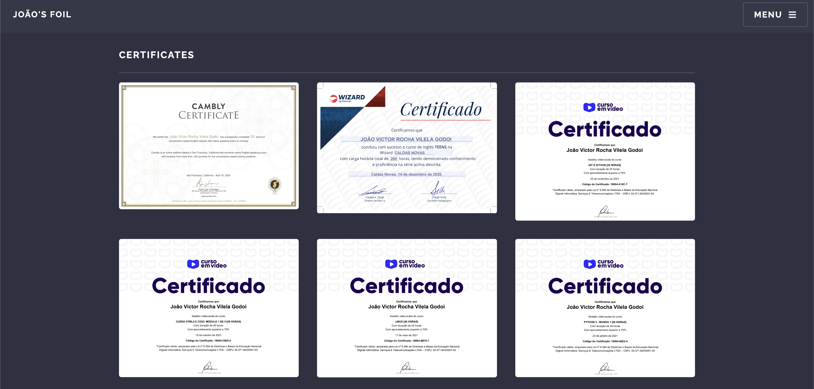

<figure>
  
  <figcaption></figcaption>
</figure>

---

## 🚀 Tecnologias / Technologies

Esse projeto foi desenvolvido com as seguintes tecnologias: 
 
This project was developed with the following technologies:

- HTML
- CSS
- JavaScript

Bibliotecas / libraries

- [Google Fonts](https://fonts.google.com/)
- [SwipeJS](https://github.com/nolimits4web/Swiper)
- [ScrollRevel](https://scrollrevealjs.org)

 

## 💻 Projeto / Project

Este projeto foi desenvolvido como a fase técnica do processo seletivo da Peki Code.

 

This project was created as the technical phase of the Peki Code selection process.

 

## 📷 Imagens / Images

Todas as imagens presentes nesse projeto são 100% feitas por mim 

 

All images present in this project are 100% made by me

 

## 📝 Licença / License

Esse projeto está sob a licença MIT. Veja o arquivo [LICENSE](.github/LICENSE.md) para mais detalhes.

 

This project is under the MIT license. see the file [LICENSE](.github/LICENSE.md) for more details.

## :tv: preview 

<figure>
  
  <figcaption></figcaption>
</figure>

<figure>
  
  <figcaption></figcaption>
</figure>

<figure>
  
  <figcaption></figcaption>
</figure>

